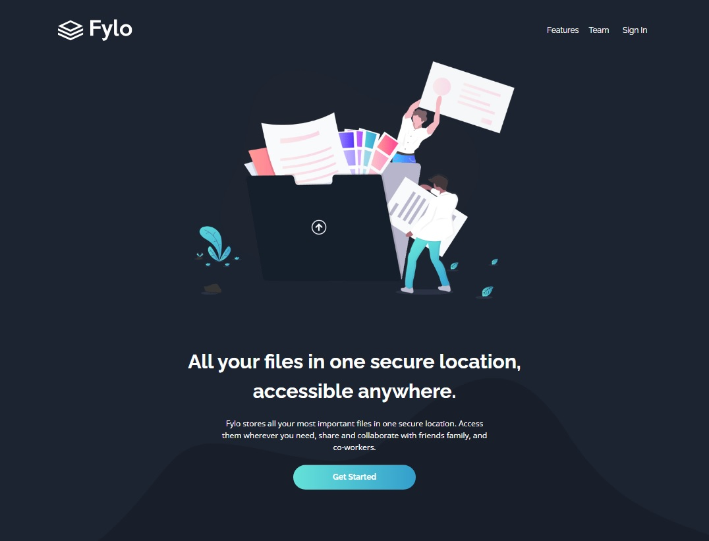

# Fylo - Landing Page con Tema Oscuro

Este proyecto es una solución al reto [Fylo dark theme landing page](https://www.frontendmentor.io/challenges/fylo-dark-theme-landing-page-5ca5f2d21e82137ec91a50fd) de Frontend Mentor. El objetivo es crear una landing page responsiva, moderna y atractiva, utilizando HTML y CSS, siguiendo el diseño proporcionado.

## Tabla de contenidos

- [Descripción general](#overview)
  - [El desafío](#the-challenge)
  - [Screenshot](#screenshot)
  - [Links](#links)
- [Mi proceso](#my-process)
  - [Tecnologías utilizadas](#built-with)
  - [Lo que aprendí](#what-i-learned)
- [Autor](#author)
- [Agradecimientos](#acknowledgments)

## Descripción General

### El desafío

Los usuarios deberían poder:

- Ver el diseño óptimo del sitio según el tamaño de la pantalla de su dispositivo.
- Ver los estados al pasar el cursor sobre todos los elementos interactivos de la página.

### Screenshot



### Links

- [Solución](https://your-solution-url.com)
- [URL del sitio](https://oliver-92.github.io/Fylo-Landing-Page/)

## Mi proceso

### Tecnologías utilizadas

- HTML5
- Propiedades personalizadas de CSS
- Flexbox
- Metodología mobile-first

### Lo que aprendí

Durante el desarrollo de este proyecto, reforcé mis conocimientos sobre maquetación con Flexbox y buenas prácticas para el diseño responsivo. También trabajé en mantener una estructura clara del HTML antes de aplicar estilos.

Ejemplo de código que me gustó cómo quedó:


```css
:root {
    --navy-850: hsl(217, 28%, 15%);
    --navy-900: hsl(218, 28%, 13%);
    --navy-950: hsl(216, 53%, 9%);
    --navy-800: hsl(219, 30%, 18%);
    --teal-200: hsl(176, 68%, 64%);
    --cyan-500: hsl(198, 60%, 50%);
    --red-500: hsl(0, 100%, 63%);
    --white: hsl(0, 0%, 100%);
    --font1: 'Open Sans', sans-serif;
    --font2: 'Raleway', sans-serif;
    --padding-container: 90px 0;
}
```

## Autor

- Website - [Ezequiel Oliver](https://oliver-92.github.io/Portafolio/)
- Frontend Mentor - [@Oliver-92](https://www.frontendmentor.io/profile/Oliver-92)

## Agradecimientos

Gracias a la comunidad de Frontend Mentor por el desafío y al autor del diseño original por el excelente layout de práctica.